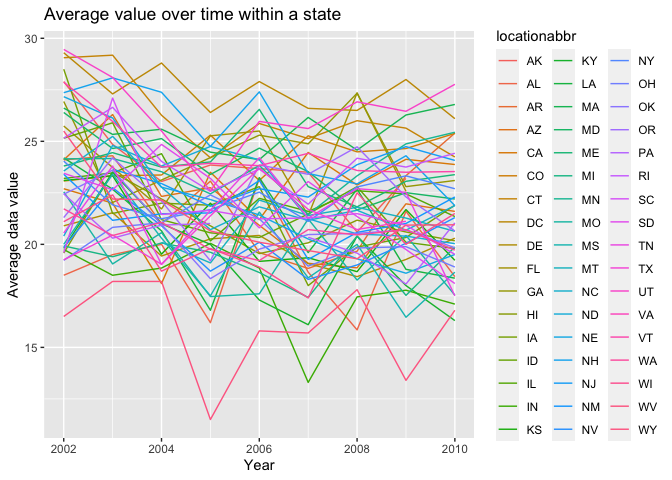

hw3\_yz4181
================
Yuanyuan Zeng(yz4181)
10/12/2021

    ## ── Attaching packages ─────────────────────────────────────── tidyverse 1.3.1 ──

    ## ✓ ggplot2 3.3.5     ✓ purrr   0.3.4
    ## ✓ tibble  3.1.4     ✓ dplyr   1.0.7
    ## ✓ tidyr   1.1.3     ✓ stringr 1.4.0
    ## ✓ readr   2.0.1     ✓ forcats 0.5.1

    ## ── Conflicts ────────────────────────────────────────── tidyverse_conflicts() ──
    ## x dplyr::filter() masks stats::filter()
    ## x dplyr::lag()    masks stats::lag()

    ## 
    ## Attaching package: 'lubridate'

    ## The following objects are masked from 'package:base':
    ## 
    ##     date, intersect, setdiff, union

## Problem 1

``` r
data("instacart")

# find the number of aisle and aisle that the most items ordered from
aisles_df =
  instacart %>% 
  group_by(aisle_id, aisle) %>% 
  summarize(order_times = n()) %>% 
  arrange(desc(order_times))

nrow(aisles_df)
```

    ## [1] 134

``` r
head(aisles_df, 5)
```

    ## # A tibble: 5 × 3
    ## # Groups:   aisle_id [5]
    ##   aisle_id aisle                      order_times
    ##      <int> <chr>                            <int>
    ## 1       83 fresh vegetables                150609
    ## 2       24 fresh fruits                    150473
    ## 3      123 packaged vegetables fruits       78493
    ## 4      120 yogurt                           55240
    ## 5       21 packaged cheese                  41699

``` r
# making plot showing number of items order in each aisle
aisles_df %>% 
  filter(
    order_times > 10000) %>% 
  ggplot(aes(x = aisle_id, y = order_times)) +
  geom_point(alpha = .5) +
  labs(
    title = "Number of items ordered from each aisle",
    x = "Aisle_id",
    y = "Number of items ordered") + 
  scale_x_continuous(
    breaks = c(0,20,40,60,80,100,120)) +
  theme_bw()
```

<!-- -->

``` r
# Table showing most popular items in three aisles
most_popular_item =
  instacart %>% 
  filter(
    aisle == "baking ingredients" | 
    aisle =="dog food care" | 
    aisle =="packaged vegetables fruits"
    ) %>% 
  group_by(aisle,product_name) %>% 
  summarize(number_of_order_times = n()) %>% 
  mutate(
    order_ranking = min_rank(desc(number_of_order_times))
  ) %>% 
  filter(order_ranking < 4)

most_popular_item
```

    ## # A tibble: 9 × 4
    ## # Groups:   aisle [3]
    ##   aisle                      product_name        number_of_order_… order_ranking
    ##   <chr>                      <chr>                           <int>         <int>
    ## 1 baking ingredients         Cane Sugar                        336             3
    ## 2 baking ingredients         Light Brown Sugar                 499             1
    ## 3 baking ingredients         Pure Baking Soda                  387             2
    ## 4 dog food care              Organix Chicken & …                28             2
    ## 5 dog food care              Small Dog Biscuits                 26             3
    ## 6 dog food care              Snack Sticks Chick…                30             1
    ## 7 packaged vegetables fruits Organic Baby Spina…              9784             1
    ## 8 packaged vegetables fruits Organic Blueberries              4966             3
    ## 9 packaged vegetables fruits Organic Raspberries              5546             2

``` r
# Table showing mean hour of the day
mean_hour_of_the_day =
  instacart %>% 
  filter(
    product_name == "Pink Lady Apples" | 
    product_name == "Coffee Ice Cream") %>% 
  select(
    product_name,
    order_dow,
    order_hour_of_day) %>% 
  mutate(
    order_dow = wday(order_dow + 1, label = TRUE)) %>% 
  group_by(
    product_name,
    order_dow) %>% 
  summarize(
    mean_order_hour_of_day = mean(order_hour_of_day)) %>% 
  pivot_wider(
    names_from = order_dow,
    values_from = mean_order_hour_of_day
  )

mean_hour_of_the_day
```

    ## # A tibble: 2 × 8
    ## # Groups:   product_name [2]
    ##   product_name       Sun   Mon   Tue   Wed   Thu   Fri   Sat
    ##   <chr>            <dbl> <dbl> <dbl> <dbl> <dbl> <dbl> <dbl>
    ## 1 Coffee Ice Cream  13.8  14.3  15.4  15.3  15.2  12.3  13.8
    ## 2 Pink Lady Apples  13.4  11.4  11.7  14.2  11.6  12.8  11.9

\#\#??? make histogram

aisles\_df %&gt;% ggplot(aes(x = aisle\_id, fill= n\_obs)) +
geom\_histogram() + labs( title = “Number of items ordered from each
aisle”, x = “aisle\_id”, y = “number of items ordered”

Summary:

In the aisles\_df, there are 134 rows and 3 variables which are
aisle\_id, aisle, and order\_times. From this table, we know that there
are 134 aisles and the aisle 83 which is corresponding to fresh
vegetables is being ordered the most. From the plot, we notice that
there are two aisle which are being ordered most. The data frame of most
popular items have 9 rows and 4 variables which are aisle,
product\_name, number of order times, and order ranking. The most
popular items in “baking ingredients” are ‘Cane Sugar’, ‘Light Brown
Sugar’, and ‘Pure Baking Soda’; in “dog food care” are ‘Organix Chicken
& Brown Rice Recipe’, ‘Small Dog Biscuits’, and ‘Snack Sticks Chicken &
Rice Recipe Dog Treats’; in “packaged vegetables fruits” are ‘Organic
Baby Spinach’, ‘Organic Blueberries’, and ‘Organic Raspberries’. The
table of mean hour of the day includes 2 rows which are ‘Pink Lady
Apples’ and ‘Coffee Ice Cream’ and 8 variables which are corresponding
to seven days in a week. The mean hour of the day at which Pink Lady
Apples and Coffee Ice Cream are ordered on each day of the week is
calculated.

## Problem 2

``` r
# Clean the data
brfss =
  brfss_smart2010 %>% 
  janitor::clean_names() %>% 
  filter(topic == "Overall Health",
         response == "Excellent" |
         response == "Poor") 


# Find the states which were observed at 7 or more locations in 2002
brfss %>% 
  filter(year == 2002) %>% 
  group_by(locationabbr) %>% 
  summarize(n_obs = n()) %>% 
  filter(n_obs >=7)
```

    ## # A tibble: 17 × 2
    ##    locationabbr n_obs
    ##    <chr>        <int>
    ##  1 CO               8
    ##  2 CT              14
    ##  3 FL              14
    ##  4 HI               8
    ##  5 MA              16
    ##  6 MD              12
    ##  7 MI               8
    ##  8 MN               8
    ##  9 NC              14
    ## 10 NH              10
    ## 11 NJ              16
    ## 12 NY              10
    ## 13 OH               8
    ## 14 PA              20
    ## 15 RI               8
    ## 16 UT              10
    ## 17 WA               8

``` r
# Find the states which were observed at 7 or more locations in 2010
states_2010 =
  brfss %>% 
  filter(year == 2010) %>% 
  group_by(locationabbr) %>% 
  summarize(n_obs = n()) %>% 
  filter(n_obs >=7)
nrow(states_2010)
```

    ## [1] 30

``` r
pull(states_2010, var = 1)
```

    ##  [1] "CA" "CO" "CT" "FL" "GA" "HI" "ID" "KS" "LA" "MA" "MD" "ME" "MI" "MN" "NC"
    ## [16] "NE" "NH" "NJ" "NM" "NY" "OH" "OR" "PA" "RI" "SC" "TN" "TX" "UT" "VT" "WA"

-   There are 17 states that were observed at 7 or more locations in
    2002 : “CO”, “CT”, “FL”, “HI”, “MA”, “MD”, “MI”, “MN”, “NC”, “NH”,
    “NJ”, “NY”, “OH”, “PA”, “RI”, “UT”, “WA”

-   There are 30 states that were observed at 7 or more location in 2010
    : “CA” “CO” “CT” “FL” “GA” “HI” “ID” “KS” “LA” “MA” “MD” “ME” “MI”
    “MN” “NC” “NE” “NH”“NJ” “NM” “NY” “OH” “OR” “PA” “RI” “SC” “TN” “TX”
    “UT” “VT” “WA”

``` r
# Construct a data set and make a plot
excellent_response = 
  brfss %>% 
  filter(response == "Excellent") %>% 
  select(year, locationabbr, data_value) %>% 
  group_by(year, locationabbr) %>% 
  summarize(average_data_value = mean(data_value))
```

    ## `summarise()` has grouped output by 'year'. You can override using the `.groups` argument.

``` r
excellent_response %>% 
  ggplot(aes(x = year, y = average_data_value, color = locationabbr))+
  geom_line() +
  labs(
    title = "Average value over time within a state",
    x = "Year",
    y = "Average data value"
  ) 
```

    ## Warning: Removed 3 row(s) containing missing values (geom_path).

<!-- -->

``` r
# Make two-panel plot
```

## Problem 3

``` r
accel_df = 
  read_csv("accel_data.csv") %>% 
  janitor::clean_names()
```

    ## Rows: 35 Columns: 1443

    ## ── Column specification ────────────────────────────────────────────────────────
    ## Delimiter: ","
    ## chr    (1): day
    ## dbl (1442): week, day_id, activity.1, activity.2, activity.3, activity.4, ac...

    ## 
    ## ℹ Use `spec()` to retrieve the full column specification for this data.
    ## ℹ Specify the column types or set `show_col_types = FALSE` to quiet this message.
