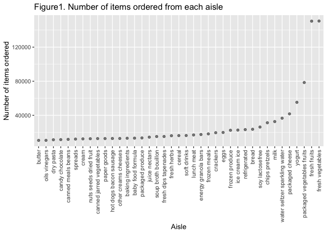

hw3\_yz4181
================
Yuanyuan Zeng(yz4181)
10/12/2021

    ## ── Attaching packages ─────────────────────────────────────── tidyverse 1.3.1 ──

    ## ✓ ggplot2 3.3.5     ✓ purrr   0.3.4
    ## ✓ tibble  3.1.4     ✓ dplyr   1.0.7
    ## ✓ tidyr   1.1.3     ✓ stringr 1.4.0
    ## ✓ readr   2.0.1     ✓ forcats 0.5.1

    ## ── Conflicts ────────────────────────────────────────── tidyverse_conflicts() ──
    ## x dplyr::filter() masks stats::filter()
    ## x dplyr::lag()    masks stats::lag()

    ## 
    ## Attaching package: 'lubridate'

    ## The following objects are masked from 'package:base':
    ## 
    ##     date, intersect, setdiff, union

## Problem 1

``` r
data("instacart")

# making plot showing number of items order in each aisle
aisles_df =
  instacart %>% 
  group_by(aisle_id, aisle) %>% 
  summarize(n_obs = n()) %>% 
  filter(
    n_obs > 10000) 
```

    ## `summarise()` has grouped output by 'aisle_id'. You can override using the `.groups` argument.

``` r
aisles_df %>% 
  ggplot(aes(x = aisle_id, y = n_obs)) +
  geom_point(alpha = .5) +
  labs(
    title = "Number of items ordered from each aisle",
    x = "Aisle_id",
    y = "Number of items ordered") + 
  scale_x_continuous(
    breaks = c(0,20,40,60,80,100,120)) +
  theme_bw()
```

<!-- -->

``` r
# Table showing most popular items in three aisles
most_popular_item =
  instacart %>% 
  filter(
    aisle == "baking ingredients" | 
    aisle =="dog food care" | 
    aisle =="packaged vegetables fruits"
    ) %>% 
  group_by(aisle,product_name) %>% 
  summarize(count= n()) %>% 
  mutate(
    order_ranking = min_rank(desc(count))
  ) %>% 
  filter(order_ranking < 4)
```

    ## `summarise()` has grouped output by 'aisle'. You can override using the `.groups` argument.

``` r
# Table showing mean hour of the day
hour =
  instacart %>% 
  filter(
    product_name == "Pink Lady Apples" | 
    product_name == "Coffee Ice Cream"
  ) %>% 
  select(
    product_name,
    order_dow,
    order_hour_of_day
  ) %>% 
  mutate(
    order_dow = wday(order_dow + 1, label = TRUE)
  ) %>% 
  group_by(
    product_name,
    order_dow
    ) %>% 
  summarize(
    mean_order_hour_of_day = mean(order_hour_of_day)
  ) %>% 
  pivot_wider(
    names_from = order_dow,
    values_from = mean_order_hour_of_day
  )
```

    ## `summarise()` has grouped output by 'product_name'. You can override using the `.groups` argument.

\#\#??? make histogram

``` r
aisles_df %>% 
  ggplot(aes(x = aisle_id, fill= n_obs)) +
  geom_histogram() +
  labs(
    title = "Number of items ordered from each aisle",
    x = "aisle_id",
    y = "number of items ordered"
  )
```

    ## `stat_bin()` using `bins = 30`. Pick better value with `binwidth`.

<!-- -->

There are 134 aisles. The aisle 83 which is corresponding to fresh
vegetables is being ordered the most.

## Problem 3

``` r
accel_df = 
  read_csv("accel_data.csv") %>% 
  janitor::clean_names() %>% 
  pivot_longer(
    activity_1:activity_1440,
    names_to = "minute",
    names_prefix = "activity_",
    values_to = "activity"
  ) %>% 
  pivot_wider(
    names_from = "day",
    values_from = "activity"
  )
```

    ## Rows: 35 Columns: 1443

    ## ── Column specification ────────────────────────────────────────────────────────
    ## Delimiter: ","
    ## chr    (1): day
    ## dbl (1442): week, day_id, activity.1, activity.2, activity.3, activity.4, ac...

    ## 
    ## ℹ Use `spec()` to retrieve the full column specification for this data.
    ## ℹ Specify the column types or set `show_col_types = FALSE` to quiet this message.
