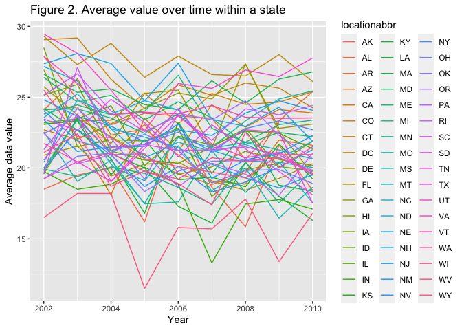

hw3\_yz4181
================
Yuanyuan Zeng(yz4181)
10/12/2021

    ## ── Attaching packages ─────────────────────────────────────── tidyverse 1.3.1 ──

    ## ✓ ggplot2 3.3.5     ✓ purrr   0.3.4
    ## ✓ tibble  3.1.4     ✓ dplyr   1.0.7
    ## ✓ tidyr   1.1.3     ✓ stringr 1.4.0
    ## ✓ readr   2.0.1     ✓ forcats 0.5.1

    ## ── Conflicts ────────────────────────────────────────── tidyverse_conflicts() ──
    ## x dplyr::filter() masks stats::filter()
    ## x dplyr::lag()    masks stats::lag()

    ## 
    ## Attaching package: 'lubridate'

    ## The following objects are masked from 'package:base':
    ## 
    ##     date, intersect, setdiff, union

## Problem 1

``` r
data("instacart")

# find the number of aisle and aisle that the most items ordered from
aisles_df =
  instacart %>% 
  group_by(aisle) %>% 
  summarize(order_times = n()) %>% 
  arrange(desc(order_times)) # order by order times for each aisle

nrow(aisles_df)
```

    ## [1] 134

``` r
head(aisles_df, 1)
```

    ## # A tibble: 1 × 2
    ##   aisle            order_times
    ##   <chr>                  <int>
    ## 1 fresh vegetables      150609

In the aisles\_df, there are 134 rows and 3 variables which are
aisle\_id, aisle, and order\_times. From this table, we know that there
are 134 aisles and the aisle 83 which is corresponding to fresh
vegetables is being ordered the most.

``` r
# making plot showing number of items order in each aisle
aisles_df %>% 
  filter(
    order_times > 10000) %>% 
  mutate(
    aisle = factor(aisle), 
    aisle = fct_reorder(aisle, order_times)
  ) %>% 
  ggplot(aes(x = aisle, y = order_times)) +
  geom_point(alpha = .5) +
  labs(
    title = "Figure1. Number of items ordered from each aisle",
    x = "Aisle",
    y = "Number of items ordered") + 
  theme(axis.text.x = element_text(angle = 90, vjust = 0.5, hjust = 1))
```

<!-- --> Figure 1
shows the number of items ordered in each aisle. We notice that fresh
vegetables and fresh fruits are two aisles that being ordered most.

``` r
# Table showing most popular items in three aisles
most_popular_item = 
  instacart %>% 
  filter(
    aisle %in% c("baking ingredients", 
                 "dog food care", 
                 "packaged vegetables fruits")) %>% 
  group_by(aisle,product_name) %>% 
  summarize(number_of_order_times = n()) %>% 
  mutate(
    order_ranking = min_rank(desc(number_of_order_times))
  ) %>% 
  filter(order_ranking < 4) %>% 
  select(-order_ranking)
  
most_popular_item
```

    ## # A tibble: 9 × 3
    ## # Groups:   aisle [3]
    ##   aisle                      product_name                     number_of_order_t…
    ##   <chr>                      <chr>                                         <int>
    ## 1 baking ingredients         Cane Sugar                                      336
    ## 2 baking ingredients         Light Brown Sugar                               499
    ## 3 baking ingredients         Pure Baking Soda                                387
    ## 4 dog food care              Organix Chicken & Brown Rice Re…                 28
    ## 5 dog food care              Small Dog Biscuits                               26
    ## 6 dog food care              Snack Sticks Chicken & Rice Rec…                 30
    ## 7 packaged vegetables fruits Organic Baby Spinach                           9784
    ## 8 packaged vegetables fruits Organic Blueberries                            4966
    ## 9 packaged vegetables fruits Organic Raspberries                            5546

The data frame of most popular items have 9 rows and 3 variables which
are aisle, product\_name, and number of order times. The most popular
items in “baking ingredients” are ‘Cane Sugar’, ‘Light Brown Sugar’, and
‘Pure Baking Soda’; in “dog food care” are ‘Organix Chicken & Brown Rice
Recipe’, ‘Small Dog Biscuits’, and ‘Snack Sticks Chicken & Rice Recipe
Dog Treats’; in “packaged vegetables fruits” are ‘Organic Baby Spinach’,
‘Organic Blueberries’, and ‘Organic Raspberries’.

``` r
# Table showing mean hour of the day
mean_hour_of_the_day =
  instacart %>% 
  filter(
    product_name %in% c("Pink Lady Apples", "Coffee Ice Cream")) %>% 
  select(
    product_name,
    order_dow,
    order_hour_of_day) %>% 
  mutate(
    order_dow = wday(order_dow + 1, label = TRUE)) %>% 
  group_by(
    product_name,
    order_dow) %>% 
  summarize(
    mean_order_hour_of_day = mean(order_hour_of_day)) %>% 
  pivot_wider(
    names_from = order_dow,
    values_from = mean_order_hour_of_day
  )

mean_hour_of_the_day
```

    ## # A tibble: 2 × 8
    ## # Groups:   product_name [2]
    ##   product_name       Sun   Mon   Tue   Wed   Thu   Fri   Sat
    ##   <chr>            <dbl> <dbl> <dbl> <dbl> <dbl> <dbl> <dbl>
    ## 1 Coffee Ice Cream  13.8  14.3  15.4  15.3  15.2  12.3  13.8
    ## 2 Pink Lady Apples  13.4  11.4  11.7  14.2  11.6  12.8  11.9

The table of mean hour of the day includes 2 rows and 8 variables which
are products names and corresponding to seven days in a week. The mean
hour of the day at which Pink Lady Apples and Coffee Ice Cream are
ordered on each day of the week is calculated.

## Problem 2

``` r
data("brfss_smart2010")

# Clean the data
brfss =
  brfss_smart2010 %>% 
  janitor::clean_names() %>% 
  filter(topic == "Overall Health",
         response %in% c("Excellent","Poor", "Very good", "Good", "Fair")) %>% 
  mutate(
    response = forcats::fct_relevel(response, c("Poor", "Fair", "Good", "Very good", "Excellent"))
  )
```

After cleaning the data set, there are 23 variables and 10625 rows. The
table only include responses from “Poor” to “Excellent”.

``` r
# Find the states which were observed at 7 or more locations in 2002
locations_2002 =
  brfss %>% 
  filter(year == 2002) %>% 
  group_by(locationabbr) %>% 
  summarize(n_obs = n()) %>% 
  filter(n_obs >=7)

nrow(locations_2002)
```

    ## [1] 36

``` r
pull(locations_2002,locationabbr)
```

    ##  [1] "AZ" "CO" "CT" "DE" "FL" "GA" "HI" "ID" "IL" "IN" "KS" "LA" "MA" "MD" "ME"
    ## [16] "MI" "MN" "MO" "NC" "NE" "NH" "NJ" "NV" "NY" "OH" "OK" "OR" "PA" "RI" "SC"
    ## [31] "SD" "TN" "TX" "UT" "VT" "WA"

-   There are 36 states that were observed at 7 or more locations in
    2002 and the names of locations are listed above.

``` r
# Find the states which were observed at 7 or more locations in 2010
locations_2010 = 
  brfss %>% 
  filter(year == 2010) %>% 
  group_by(locationabbr) %>% 
  summarize(n_obs = n()) %>% 
  filter(n_obs >=7)

nrow(locations_2010)
```

    ## [1] 45

``` r
pull(locations_2010,locationabbr)
```

    ##  [1] "AL" "AR" "AZ" "CA" "CO" "CT" "DE" "FL" "GA" "HI" "IA" "ID" "IL" "IN" "KS"
    ## [16] "LA" "MA" "MD" "ME" "MI" "MN" "MO" "MS" "MT" "NC" "ND" "NE" "NH" "NJ" "NM"
    ## [31] "NV" "NY" "OH" "OK" "OR" "PA" "RI" "SC" "SD" "TN" "TX" "UT" "VT" "WA" "WY"

-   There are 45 states that were observed at 7 or more location in 2010
    and the names of locations are listed above

``` r
# Construct a data set and make a "spaghetti" plot
excellent_response = 
  brfss %>% 
  filter(response == "Excellent") %>% 
  select(year, locationabbr, data_value) %>% 
  group_by(year, locationabbr) %>% 
  summarize(average_data_value = mean(data_value, na.rm = T))

excellent_response %>% 
  ggplot(aes(x = year, y = average_data_value, color = locationabbr))+
  geom_line() +
  labs(
    title = "Figure 2. Average value over time within a state",
    x = "Year",
    y = "Average data value"
  ) 
```

<!-- --> Figure 2
show the average value over time within a state. We notice that most of
average data value fall between 20 to 25.

``` r
# Make two-panel plot
brfss %>%
  filter(locationabbr == "NY",
         year %in% c(2006,2010)) %>% 
  ggplot(aes(x = response, y = data_value)) +
  geom_point() + 
  geom_boxplot() +
  facet_grid(.~year)
```

<!-- --> In 2006,
the mean value of data value is increasing from “Poor” to “Very good”.
The mean value of data value for “Excellent” is less than that for “Very
good” and “Good”. The distribution of data value for “Good” is most
widespread among all responses, In 2010, the mean value of data value is
also increasing from “Poor” to “Very good”. The mean of data value for
“Excellent” is smaller than that for “very good” and “good”. The
distribution of data value for “Very good” is most widespread. The
distribution of data value for “poor” in 2006 and 2010 are most narrow
among all responses. From these two plots, we notice that the mean value
for responses in two years are approximately the same.

## Problem 3

``` r
accel_df = 
  read_csv("accel_data.csv") %>% 
  janitor::clean_names() %>% 
  mutate(
    weekday_weekend = 
      ifelse(day %in% c("Monday", "Tuesday", "Wednesday", "Thursday", "Friday"), "weekday",
      ifelse(day %in% c("Saturday","Sunday"), "weekend", NA))) %>% 
  pivot_longer(
    activity_1:activity_1440,
    names_to = "time",
    names_prefix = "activity_",
    values_to = "activity_count"
  ) %>% 
  mutate(
    time = as.numeric(time)
  )
```

The original data records the activity in 5 weeks which are 35 days. In
each day, the activity data is recorded 1440 times. After tidying the
data, we aggregate all variables starting with “activity\_” into one
column “time”. Now, the data set includes 6 variable: week, day\_id,
day, weekday\_weekend, time, and activity\_count.

``` r
#showing total activity for each day
total_activity =
  accel_df %>% 
  group_by(week, day_id) %>% 
  summarize(
    total_acti = sum(activity_count))

head(total_activity, 10)
```

    ## # A tibble: 10 × 3
    ## # Groups:   week [2]
    ##     week day_id total_acti
    ##    <dbl>  <dbl>      <dbl>
    ##  1     1      1    480543.
    ##  2     1      2     78828.
    ##  3     1      3    376254 
    ##  4     1      4    631105 
    ##  5     1      5    355924.
    ##  6     1      6    307094.
    ##  7     1      7    340115.
    ##  8     2      8    568839 
    ##  9     2      9    295431 
    ## 10     2     10    607175

``` r
ggplot(total_activity, aes(x = day_id, y = total_acti)) +
  geom_point() +
  geom_line()+
  labs(
    x = "Day",
    y = "Total Activity in a Day",
    title = "Figure3. Total activity in Each Day") +
  scale_y_continuous(breaks = c(0,1E05, 2E05, 3E05, 4E05, 5E05, 6E05, 7E05))
```

<!-- --> The
table includes three variables which are week, day\_id, and total
activity. Figure 3 shows the total activity in each day over 5 weeks.
There is no apparent trend over the weeks. Most of the total activity in
a day fall between 300000 and 500000.

``` r
# showing the activity over the course of the day
accel_df %>% 
  group_by(day, time) %>% 
  mutate(activity_count = mean(activity_count)) %>% 
  ggplot(aes(
      x = time,
      y = activity_count,
      color = day)) +
  geom_smooth(aes(group = day)) +
  scale_x_continuous(
    breaks = c(0,300, 600, 900, 1200, 1440),
    labels = c("0AM","5AM", "10AM","3PM","8PM","12AM")) +
  scale_y_continuous(
    breaks = c(0, 300, 600, 900)) +
  labs(
    x = "Time",
    y = "Activity Count",
    title = "Figure 4. Activity count over the course of the day")
```

<!-- --> Figure 4
shows that the activity counts are lower than 300 during sleeping time
which is between 11 PM to 8AM. The activity counts are higher during day
time which is between 300 to 600 counts. The Saturday morning and Friday
night are two periods which have two highest activity counts (&gt;600
counts) comparing with other period of time.
